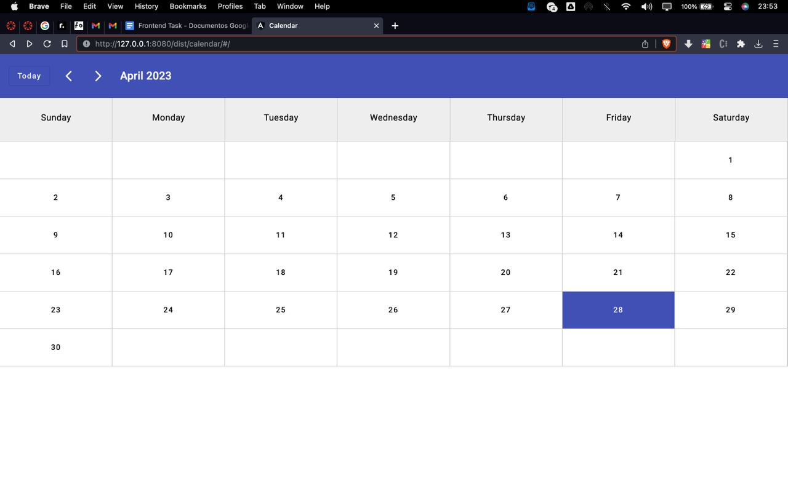

# Angular Calendar

This is a basic calendar application built from scratch using only Angular Material and Angular CDK.

See it running [here](https://angularcalendar.netlify.app/).

The application offers the following features:
- a form to create new appointments;
- the ability to delete existing appointments;
- the ability to move appointments;
- the use of Date() to work with date and time;
- mouse drag and drop functionality using Angular CDK;
- the use of NgFor to render calendar dates and appointments.

## Screenshots

    
    

 

    
    

## Development

To run the development server, use the command `ng serve` and navigate to [http://localhost:4200/](http://localhost:4200/).
 
The application will automatically reload if any changes are made to the source files.

## Build

To build the project, use the command `ng build`. The resulting build artifacts will be stored in the `dist/` directory.
